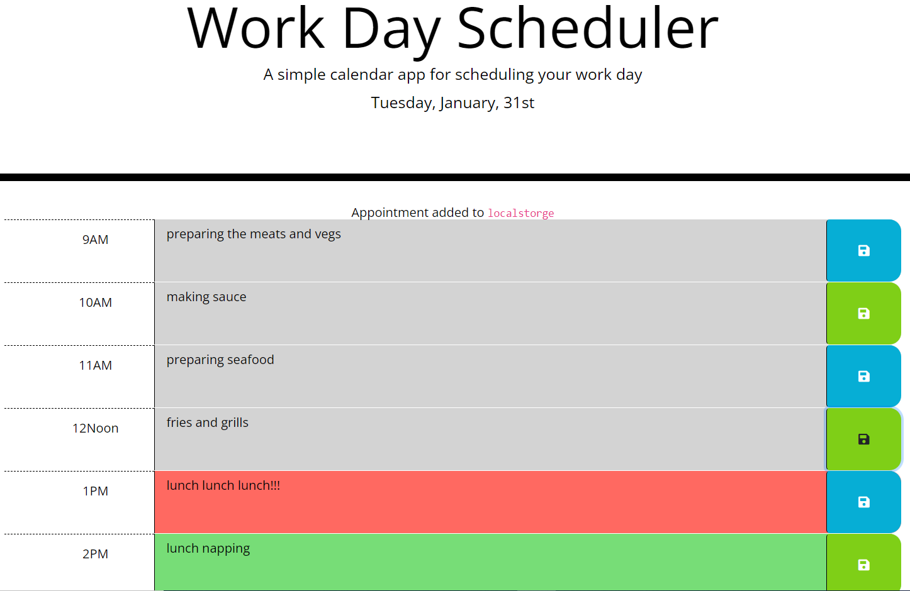

# daily-planner

A to-do list app using jQuery and Moment.js

## Meme

## Screenshots

## Usage

1. visit [GitHub pages](https://v7lanw.github.io/daily-planner/).
2. choose a time, and type in your activities plan.
3. Considering personal privacy, all the activities are stored locally, you could check the source code, or use F12 to inspect local storage of your browser.

## deployment

https://v7lanw.github.io/daily-planner/

## 